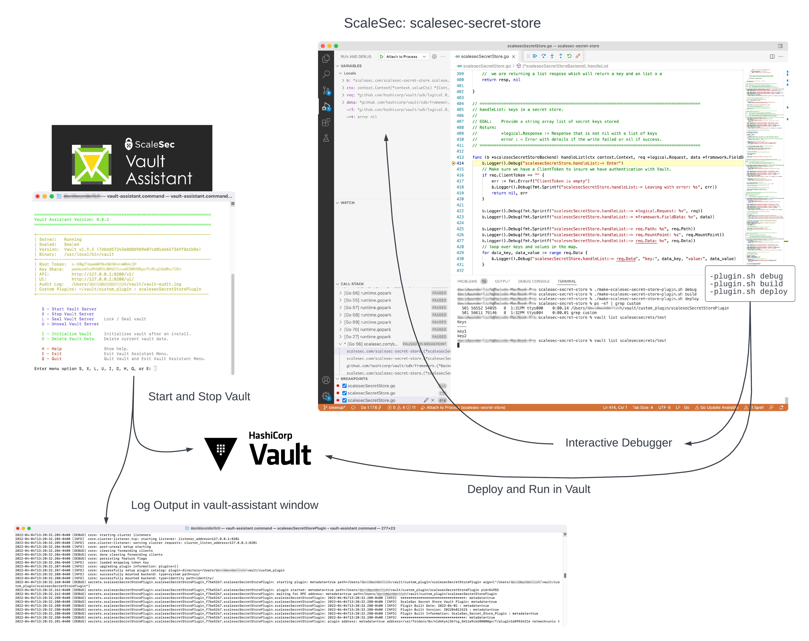

# scalesec-secret-store:   
Vault Custom Plugin **scalesecSecretStore** is an example Hashicorp custom secret engine plugin based off the Hashicorp [vault-guides](https://github.com/hashicorp/vault-guides/tree/master/plugins). This version helps illustrate how to create a custom secret store backend and provides a starting point to help jump start your own custom plugin develoment.It does this by providing:
- Comments in the code explaining what the sections of code are doing
- Logging in all the defined functions so you can see the plugin life cycle at work.
- Providing a unified development; testing and debugging experience under one single project



**Setup:**


* Installation of [Go Lang](https://go.dev/) is required to build the plugin. A fundamental knowledge of go is not required but is recommended.   
* Installation of Hashicorp Vault is required.  It is recommend you use the ScaleSec Vault Assistant project: https://github.com/ScaleSec/vault-assistant to install vault. This helps provide the unified experience.
* VSCode is recommended for an IDE and is what we base our examples on.
* Checkout the scalesec-secret-store project from GitHub.

**Useage:**

`make-scalesec-secret-store-plugin.sh`: command script to help you build and deploy the plugin code.  It takes in the following arguments in sequence you wish executed:  
* debug - Set the debug flags for the a build
* build - Build the plugin
* deploy - Deploy and Register the plugin to vault.  Handles removing prior installs
* test - Run all the test functions listed below
* test_list - Test/Run just the vault list function
* test_read - Test/Run just the vault read function
* test_write - Test/Run just the vault write function
* test_delete - Test/Run just the vault delete function

_Example Usage:_  
`make-scalesec-secret-store-plugin.sh build deploy`


## Debugging

There are two options using the interactive debugger in VSCode.  
* Command Line  
* VSCode Debugger GUI

**Setup:**   
* Install of "Delve" is required. The most common way to install is running the command: `go install github.com/go-delve/delve/cmd/dlv@latest`    

For more detailed install information visit the Delve web site:  https://github.com/go-delve/delve

* Compile for debugging.  Compile with the flags: -gcflags "all=-N -l". Run: `make-scalesec-secret-store-plugin.sh debug build`

 **_Command Line_**  
1. Install and register your plugin. `make-scalesec-secret-store-plugin.sh deploy`
2. Run a vault command to start the plugin backend. `vault list scalesecsecrets/test`
3. Locate the process that above step created. `ps -ef | grep scalesecSecretStorePlugin` or `pgrep scalesecSecretStorePlugin`
4. Run dlv to attach to the process `$HOME/go/bin/dlv attach 56135` You should now have a (dlv) command line.
5. Set some breakpoins and now your ready to invoke your plugin to debug  
   - [ ] `export VAULT_CLIENT_TIMEOUT=300` To extend the CLI timeout to give you time to debug  
   - [ ] `vault list scalesecsecrets/test` Run the command you want to debug

_Delve Commands:_ Enter help to learn the commands to use dlv.  Hear are some to help

* b = set break point
* n = next line
* c = continue to next break point
* args = show values of arguments passed to current function
* locals = show values of local function variables
* exit = exit

 **_VSCode Debugger GUI_**  

1. Install and register your plugin. `make-scalesec-secret-store-plugin.sh deploy`
2. Run a vault command to start the plugin backend. `vault list scalesecsecrets/test`
3. Locate the process that above step created. `ps -ef | grep scalesecSecretStorePlugin` or `pgrep scalesecSecretStorePlugin`
4. Create a debug "launch.json" file:  https://code.visualstudio.com/docs/editor/debugging
5. Your launch.json should contain the following block of code.  #### should be replaced with the process number you located in step 3  
   ```
    {
        "name": "Attach to local process",
        "type": "go",
        "request": "attach",
        "mode": "local",
        "processId": ####
    }
   ```
6. Run this launch config from the debugger. 
7. Set some breakpoints and now your ready to invoke your plugin to debug  
   - [ ] `export VAULT_CLIENT_TIMEOUT=300` To extend the CLI timeout to give you time to debug  
   - [ ] `vault list scalesecsecrets/test` Run the command you want to debug


# References 
Developing this example the following references were very helpful.

- https://learn.hashicorp.com/tutorials/vault/getting-started-secrets-engines
- https://learn.hashicorp.com/tutorials/vault/plugin-backends
- https://discuss.hashicorp.com/t/debug-vault-plugin-with-vs-code/14806/2
- https://groups.google.com/g/vault-tool/c/oV5bi1ls76s
- https://github.com/golang/vscode-go/blob/master/docs/debugging.md
- https://github.com/golang/vscode-go/blob/master/docs/debugging-legacy.md#selecting-legacy-debug-adapter
